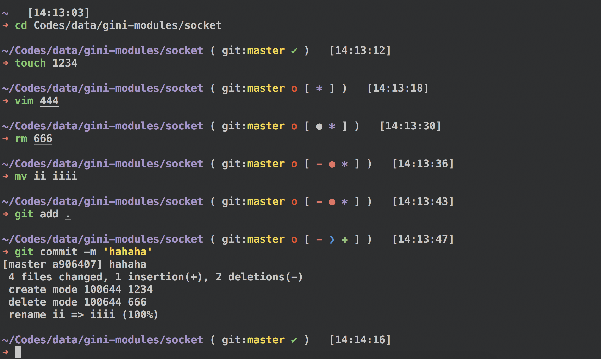
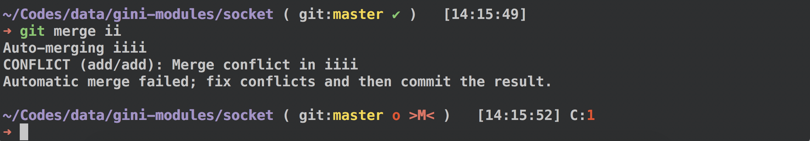

#### 本主题基于ys主题修改



#### Features
- git status
	- ``o``   ——Dirty branch
	- ``✔``  ——Clean branch
	- ``>M<``  ——  diff
	- ``✚``  —— Added files
	- ``-`` —— Deleted
	- ``●`` ——  Modified
	- ``❯`` —— Renamed
	- ``═`` —— Unmerged
	- ``*`` —— Untracked


## 安装
### 1、init
- clone repo
````
git clone https://github.com/txw-yates/ys-change-zsh-theme.git ~/
````
- 移动主题文件
````
mv ~/ys-change-zsh-theme/ys-change.zsh-theme  ${ZSH_THEMES:-~/.oh-my-zsh/themes}
````
- 修改.zshrc文件
````
ZSH_THEME="ys-change"
````
- source
````
source ~/.zshrc
````

### 2、导入[darkside](https://github.com/bahlo/iterm-colors/blob/master/colors/Darkside.itermcolors)主题到iterm，并且选中改颜色

### 3、 安装[zsh-syntax-highlighting](https://github.com/zsh-users/zsh-syntax-highlighting.git)插件
- 从git克隆  zsh-syntax-highlighting
````
git clone https://github.com/zsh-users/zsh-syntax-highlighting.git ${ZSH_CUSTOM:-~/.oh-my-zsh/custom}/plugins/zsh-syntax-highlighting
````
- 修改.zshrc
````
plugins=( [plugins...] zsh-syntax-highlighting)
````
- source
````
source ~/.zshrc
````